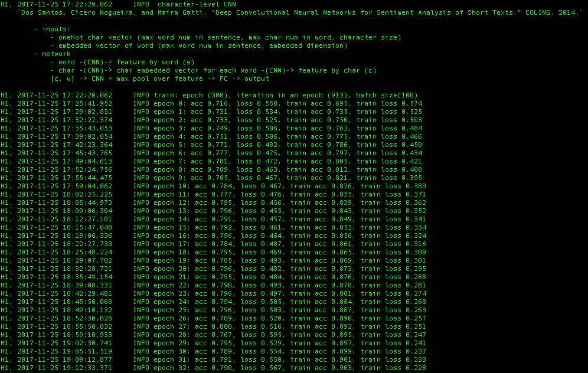

# Short Sentence Modelling
[](https://www.tensorflow.org/)
[](https://github.com/asahi417/SequenceModeling/blob/master/LICENSE)

Implement classification model for [Stanford Sentiment Treebank](https://nlp.stanford.edu/sentiment/index.html).
Input data are sentences, which is review of movie and output label is binarized as *Good* or *Bad*.
Here, neutral evaluation is removed.

- This code is supported python 3 and tensorflow 1.3.0.

## How to use.
### Setup
First, clone the repository and run setup.

```
git clone https://github.com/asahi417/SequenceModeling 
cd SequenceModeling
pip install -r requirements.txt
python setup.py test
mkdir data
```

Then, you need to install [pretrained word2vector by Google news](https://drive.google.com/uc?id=0B7XkCwpI5KDYNlNUTTlSS21pQmM&export=download)
to get `GoogleNews-vectors-negative300.bin.gz`.
Also, you have to access [Stanford Sentiment Treebank](https://nlp.stanford.edu/sentiment/index.html)
to get `stanfordSentimentTreebank.zip`. Finally, move them to `SequenceModeling/data/`
and unzip those files. 

### Train model
In python
```python
import sequence_modeling
import gensim
  
# load sst data
data = sequence_modeling.sst("./data/stanfordSentimentTreebank", binary=True, cut_off=2)
_x, _y = data["sentence"], data["label"]
  
# set network architecture
net = {"label_size": 2, "input_char": [40, 33, 26], "input_word": [40, 300],
       "char_embed_dim": 5, "char_cnn_unit": 10, "char_cnn_kernel": 3, "word_embed_dim": 30,
       "cnn_unit": 300, "cnn_kernel": 5, "hidden_unit": 300}
  
# get model instance (here, character-level CNN is used)
_model = sequence_modeling.model.CharCNN
  
# set preprocessing functions for data
w2v = gensim.models.KeyedVectors.load_word2vec_format("./data/GoogleNews-vectors-negative300.bin", binary=True)
pre_process = [sequence_modeling.Process("onehot", {"length_word": 40, "length_char": 33}), 
                   sequence_modeling.Process("embed", {"length_word": 40, "dim": w2v.vector_size, "model": w2v})]
  
# define model inputs format 
def model_inputs(model, x):
    return {model.x_char: x[0], model.x_word: x[1]}
  
# train
feeder = sequence_modeling.BatchFeeder(_x, _y, batch_size=100, validation=0.2, process=pre_process)
sequence_modeling.train(epoch=150, model=_model, feeder=feeder, save_path="./", model_inputs=model_inputs)
```

or you can use sample script by 
```
python sample_train.py char_cnn -e 300 -b 100 -l 0.0001
```
then you will get following log.
<p align="center">
  
  <br><i> training progress log</i>
</p>


### References
- Dos Santos, Cícero Nogueira, and Maira Gatti. "Deep Convolutional Neural Networks for Sentiment Analysis of Short Texts." COLING. 2014.
- Kim, Yoon. "Convolutional neural networks for sentence classification." arXiv preprint arXiv:1408.5882 (2014).
- Socher, Richard, et al. "Recursive deep models for semantic compositionality over a sentiment treebank." Proceedings of the 2013 conference on empirical methods in natural language processing. 2013.